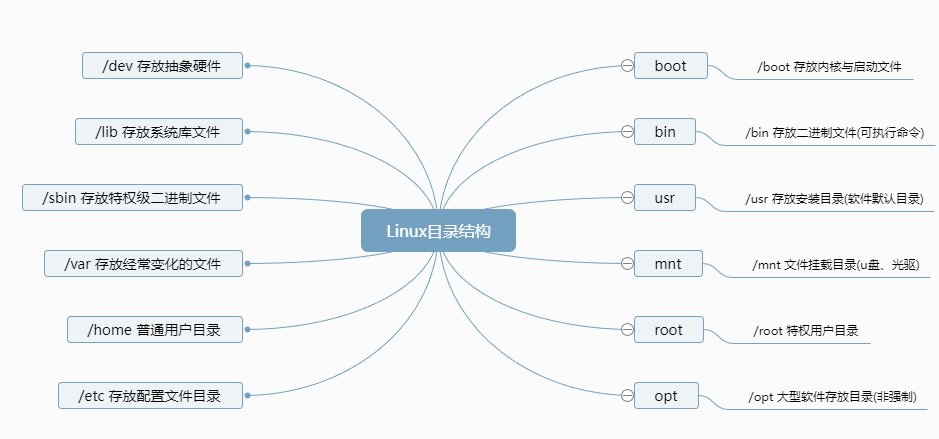

## Linux目录结构




## vim快捷键

vim提供的上下左右 

- h 向左

- j 向下
- k 向上
- l 向右

```shell
# 移动光标的快捷键
w 移动到下一个单词
b 移动到上一个单词
数字0 移动到 行首
符号$ 移动到 行尾
按下g 移动到文章开头
按下G 移动到文章结尾
按下H 移动到屏幕的开头
按下L 移动到屏幕的结尾
按下M 移动到屏幕的中间
```

命令模式的查找

```shell
向下查找 /要查找的内容
eg: /love 向下查找love相关的信息，按下n跳转到下一个单词

向上查找 ?要查找的内容
eg: ?love 向上查找love相关的信息，按下n跳转到下一个单词
```

命令模式下的复制，粘贴，删除

```shell
输入yy 复制光标所在行
输入4yy 复制4行内容
输入p 打印粘贴内容
输入dd 删除光标当前行
输入D 删除光标当前位置到行尾的内容
输入x 删除光标当前字符，向后删除
输入X 删除光标当前字符，向前删除
输入u 撤销上一步的动作
```

快捷操作

```shell
输入C 删除光标所在位置，到行尾的内容，且进入编辑模式
输入o 在当前光标的下一行开始编辑
输入O 在当前光标的上一行开始编辑
输入A 快速进入行尾，且进入编辑模式
输入zz 快速保存退出
```

批量快捷操作

```shell
步骤：
1.输入ctrl+v 进入可视块模式
2.用上下左右命令，选择操作的块

# 快捷删除
3.选中块后，输入d 删除块内容

# 快捷插入多行
4.选中块后，输入I，进行写入
5.按下两次Esc，自动生成多行
```


### 文件内容查看指令

- cat由第一行开始显示文件内容
- tac从最后一行开始显示
- nl显示的时候，输出行号
- more 一页一页显示文件内容
- less 与more类似，可以往前翻页
- head 只看头几行
- tail 只看尾几行

#### 基本显示：cat、tac

```shell
# 语法：cat [-AbEnTvs] 文件
# 选项与参数
-A: 相当于-vET的整合选项，可列出一些特殊字符而不是空白而已
-v: 列出一些看不出来的特殊字符
-E: 将结尾的断行字节$显示出来
-T: 将[tab]按键以^|显示出来
-b: 列出行号，空白行不标行号(跳过空白行)
-n: 列出行号，空白行也会有行号
-s: 减少空行数量，多行空行变一行

【实例：合并多个文件】
cat test1.txt test2.txt > example.txt

# tac与cat命令相反，文件内容从最后一行开始显示
```


#### 显示行号：nl

```shell
# 语法：nl [-bnw] 文件
# 选项与参数
-b: 指定行号指定的方式，主要有两种：
	-b a: 表示不论是否为空行，也同样列出行号(类似cat -n)
	-b t: 如果有空行，空的那一行不要列出行号(默认值)
-n: 列出行号表示的方法，主要有三种：
	-n ln: 行号在屏幕的最左方显示
	-n rn: 行号在自己栏位的最右方显示，且不加0
	-n rz: 行号在自己栏位的最右方显示， 且加0
-w: 行号栏位的占用的位数
```


#### 分屏显示：more、less

```shell
# 语法：more 文件
# more运行时可以输入的命令
空格键(space): 代表向下翻一页
Enter: 代表向下翻[一行]
/字符串: 代表在这个显示的内容当中，向下搜寻[字符串]这个关键字
:f： 立刻显示出档名以及目前显示的行数
q: 代表离开more，不再显示该文件内容
b: 代表往回翻页，只对文件有用

# 语法：less 文件
# less运行时可以输入的命令
空白键: 向下翻动一页
[pagedown]: 向下翻动一页
[pageup]: 向上翻动一页
/字串: 向下搜寻『字串』的功能
?字串: 向上搜寻『字串』的功能
n: 重复前一个搜寻 (与 / 或 ? 有关！)
N: 反向的重复前一个搜寻 (与 / 或 ? 有关！)
q: 离开 less 这个程序
```


#### 取首尾n行：head、tail

```shell
# 语法：head [-n number] 文件
# 选项与参数
-n: 后面接数字，代表显示几行的意思(默认情况显示前面10行)
【实例：显示前20行】
head -n 20 example.txt

# 语法：tail [-n number] 文件
# 选项与参数
-n: 后面接数字，代表显示几行的意思(默认情况显示前面10行)
-f: 表示持续侦测后面所接的文件名(若文件不存在命令不生效)，[crtl-c]才会结束tail的侦测
-F: 表示持续侦测后面所接的文件名(文件不存在也侦测)，[crtl-c]才会结束tail的侦测
```


### 文件管理

#### 输出重定向：>

可将本应显示在终端上的内容保存到指定文件中


==注意：==>输出重定向会覆盖原来的内容，>>输出重定向则会追加到文件的尾部

[实例]

1.cat example.txt > test.txt (读取example.txt文件内容，且以覆盖形式写入到test.txt文件中)

2.cat example.txt >> test.txt (读取example.txt文件内容，且以追加的形式写入到test.txt文件中)

3.cat < example.txt （把example.txt文件中的数据，发送给cat命令去读取)

4.xargs -n 3 < example.txt (将example.txt文本内容拆分成多行，这里限制每行3个)


#### 管道：|

一个命令的输出可以通过管道做为另一个命令的输入


#### cut命令

在文件的每一行中提取片段

```shell
# 语法 cut [参数] [数值区间] 文件
# 选项与参数
-b: 以字节为单位分割
-n: 取消分割多字节字符，与-b一起用
-c: 以字符为单位
-d: 自定义分隔符，默认以tab为分隔符
-f: 与-d一起使用，指定显示哪个区域
N 第N个字节，字符或字段，从1计数起
N- 从第N个字节，字符或字段，直至行尾
N-M 从第N到第M（包括第M）个字节、字符或字段
-N 从第1到第N（包括第N）个字节、字符或字段
```


#### sort命令

将输入的文件内容按照规则排序，然后输出结果

```shell
# 语法： sort [选项] 文件
# 选项与参数
-b: --ingore-leading-blanks 忽略前导的空白区域
-n: --numeric-sort 根据字符串数值比较
-r: --reverse 反转排序
-u: --unique 去重排序，配合-c 严格检验排序，不配合-c，则只输出一次排序结果
-t: --field-separator-分隔符 使用指定的分隔符代替非空格到空格的转换
-k: --key-位置1[,位置2] 在位置1 开始一个key，在位置2 终止(默认为行尾)
```

 

#### 创建目录：mkdir

```shell
# 语法： mkdir [-mp] 目录名称
# 选项与参数
-m: 指定被创建目录的权限，而不是根据默认权限(umask)设定
-p: 递归创建所需要的目录
【实例：指定被创建目录的权限】
mkdir example -m 711
	example文件夹：user可读、写、执行权限，group和other只有执行权限

【实例：递归创建目录】
mkdir -p test1/test2/test3/test4
```


#### 修改文件权限：chmod

修改文件权限有两种使用格式：字母法与数字法

```shell
# 字母法：chmod u/g/o/a +/-/= rwx 文件
[u/g/o/a]
	u: user表示该文件的所有者
	g: group表示与该文件的所有者属于同一组者，即用户组
	o: other表示其他人
	a: all表示这三者都是
[+/-/=]
	+: 增加权限
	-: 撤销权限
	=: 设定权限
rwx
	r: read表示可读取，数字代号为"4"
	w: write表示可写入，数字代号为"2"
	x: excute表示可执行，数字代号为"1"
【实例】
chmod u=rwx,g=rx,o=r filename <=> chmod u=7,g=5,o=4 filename
	user文件所有者：读、写、执行权限
	group用户组：读、执行权限
	other：执行的权限
chmod 777 file : 所有用户拥有读、写、执行权限
chmod 777 test/ -R : 递归test目录下所有文件加777权限
```


#### 删除文件：rm

```shell
# 语法：rm [-ifr] 文件
# 选项与参数
-i: 以进行交互方式执行(会有提示)
-f: 强制删除，忽略不存在的文件，无需提示
-r: 递归删除目录下的内容，删除文件夹时必须加此参数
```


#### 建立链接文件：ln

```shell
# 语法
# 软链接
ln -s 源文件 链接文件 
# 硬链接
ln 源文件 链接文件
```

==注意：==

①软链接类似于Windows下的快捷方式，如果软链接文件和源文件不在同一个目录，源文件要使用绝对路径，不能使用相对路径。

②硬链接只能链接普通文件不能链接目录


#### 文本搜索：grep

```shell
# 语法 grep [-rv] '搜索内容串' 文件名
# 选项与参数
-r: 递归的方式查找
-v: 反向查找，打印出不符合条件行的内容

【实例:在data.yaml文件中搜索'data'】
grep 'data' data.yaml
【实例：在当前目录，查找前缀有food字样的文件中包含data字符串的文件，并打印出该字符串所在行的内容】
grep data food*
【实例：以递归的方式查找指定目录data及其子目录下所有文件中包含字符串"food"的文件，并打印出该字符串所在行的内容】
grep -r food data
```


#### 查找文件：find

```shell
# 语法：find path -option [-print] [-exec -ok command] {} \;
# 常用参数说明
-perm xxxx: 权限为xxxx的文件或目录
-user: 按照文件属主来查找文件
-size n: n单位，b: 512位元组的区块，c: 字元数，k: kilo bytes，w:二个位元组
-mount, -xdev: 只检查和指定目录在同一个文件系统下的文件，避免列出其它文件系统中的文件
-amin n: 在过去n分钟内被读取过
-anewer file: 比文件file更晚被读取过的文件
-atime n: 在过去n天内被读取过的文件
-cmin n: 在过去n分钟内被修改过
-cnewer file: 比文件file更新的文件
-ctime n: 在过去n天内被修改过的文件
-empty: 空的文件
-gid n or -group name: gid是n或是group名称是name
-ipath p,-path p: 路径名称符合p的文件，ipath会忽略大小写
-name name，-iname name: 文件名称符合name的文件。iname会忽略大小写
-type 查找某一类型的文件：
	b-块设备文件
	d-目录
	c-字符设备文件
	p-管道文件
	l-符号链接文件
	f-普通文件
-exec命令名{} \(注意："}"和"\"之间有空格)

# 常用用法
find ./ -name test.sh => 查找当前目录(及其子目录下)所有名为test.sh的文件
find ./ -name '*.sh' => 查找当前目录下所有后缀为'.sh'的文件
find ./ -name "[A-Z]*" => 查找当前目录下所有以大写字符开头的文件
find /tmp -size 2M => 查找在/tmp目录下等于2M的文件
find /tmp -size +2M => 查找在/tmp目录下大于2M的文件
find /tmp -size -2M => 查找在/tmp目录下小于2M的文件
find ./ -size +4k -size -5M => 查找当前目录下大于4k，小于5M的文件
find ./ -perm 0777 => 查找当前目录下权限为777的文件或目录

【实例】
find . -name "*.c" -size +20c => 显示当前目录中大于20字节并以.c结尾的文件名
find . -type f => 将当前目录及其子目录中所有一般文件列出
find . -ctime -20 => 将当前目录及其子目录下所有最近20天内更新过的文件列出
find /var/log -type f -mtime +7 -ok rm {} \; => 查找/var/log目录中更改时间在7日以前的普通文件，并在删除之前询问它们
find / -type f -size 0 -exec ls -l {} \; => 查找系统中所有文件长度为0的普通文件，并列出它们的完整路径
```


#### 拷贝文件：cp

```shell
# 语法: cp [选项] 源文件/目录 目标文件/目录
# 选项与参数
-a: 该选项通常在复制目录时使用，它保留链接、文件属性，并递归地复制目录，简单而言，保持文件原有属性
-f: 已经存在的目标文件不提示
-i: 交互式复制，在覆盖目标文件之前将给出提示要求用户确认，默认系统做了alias别名功能
-r: 若给出的源文件是目录文件，则cp将递归复制该目录下的所有子目录和文件，目标文件必须为一个目录名
-v: 显示拷贝进度
-l: 创建硬链接，而非复制文件本身
-s: 复制成为符号链接，相当于批量创建快捷方式
-u: 若 destination 比 source 旧才升级 destination
-p: 复制且保持文件属性不变
-d: 拷贝软链接时，保持链接属性不变

【实例】
cp data/ temp/ -ivr => 把data目录里的内容拷贝到temp目录里
```


#### 移动文件：mv

mv命令用来移动文件或目录，也可以给文件或目录重命名

```shell
# 语法：mv [-bfiut] 源文件/目录 目标文件/目录
# 选项与参数
-f: force强制的意思，如果目标文件已经存在，不会询问而直接覆盖
-i: 若目标文件已经存在，会询问是否覆盖
-v: 显示移动进度

【实例1：文件夹改名，exampleB不存在时，将目录exampleA改名为exampleB，否则将exampleA移动到exampleB中】
mv /data/exampleA /data/exampleB
【实例2：移动文件-将temp.txt文件移到目录exampleA目录中】
mv temp.txt exampleA
```


#### 归档管理：tar

可以把一系列文件归档到一个大文件中，可以把档案文件解开以恢复数据

```shell
# 语法： tar [选项] 打包文件名(自己起) 文件
# 选项与参数
-c: 生成档案文件，创建打包文件
-v: 列出归档/解档的详细过程，显示进度
-f: 指定档案文件名称，f后面一定是.tar文件，所以必须放选项最后
-t: 列出档案中包含的文件
-x: 解开档案文件
-z: 调用gzip实现了压缩功能，实现一个先打包后压缩的过程
-C: 解压到指定目录
-h: 压缩软链接的源文件
注意：除了f需要放在选项最后，其他参数的顺序任意

【实例】
tar -cvf test.tar test => 把test归档成test.tar
tar -xvf test.tar => 对test.tar进行解档
tar -zcvf test.tar.gz test => 把test压缩成test.tar.gz
tar -zxvf test.tar.gz => 解压test.tar.gz
tar -xvf test.tar.gz -C number/ => 解压到number目录下
tar -zxvf test.tar.gz --exclude test.txt => 解压test.tar.gz，排除test.txt文件
```


#### 文件压缩/解压：zip、unzip

通过zip压缩文件的目标文件不需要指定扩展名，默认扩展名为zip

```shell
# 压缩文件：zip [-r] 目标文件(没有扩展名) 源文件
# 解压文件：unzip -d 解压后目录文件 压缩文件

【实例】
zip testzip *.txt
unzip -d dir testzip.zip
```


#### 文件压缩/解压：gzip、bzip2

tar与gzip命令结合使用实现文件打包、压缩。 tar只负责打包文件，但不压缩，用gzip压缩tar打包后的文件，其扩展名一般用xxxx.tar.gz。

注意：gzip无法压缩文件夹，必须先tar对文件夹打包后，才可以gzip压缩

```shell
# 语法： gzip [选项] 被压缩文件
# 选项与参数
-d: 解压文件
-r: 压缩文件
-l: 列出压缩文件的内容

【实例】
gzip -r test.tar => 压缩test.tar变成test.tar.gz
gzip -d test.tar.gz => 解压test.tar.gz变成test.tar

# bzip2命令跟gzip用法类似
压缩用法：tar jcvf 压缩包包名 文件…(tar jcvf bk.tar.bz2 *.c)
解压用法：tar jxvf 压缩包包名 (tar jxvf bk.tar.bz2)
```


### 系统管理

#### 查看当前日历：cal

cal命令用于查看当前日历，-y显示整年日历


#### 显示或设置时间：data

设置时间格式(需要管理员权限)

date [[MMDDhhmm[[CC]YY][.ss]][.ss] +format

MM为月，DD为天，hh为小时，mm为分钟；CC为年前两位，YY为年的后两位，ss为秒


#### 更改主机名

hostnamectl  set-hostname 【新的主机名】


#### 查看网络状态：netstat

常用: netstat -nltp


#### 查看进程信息：ps

**常见用法：**

- ps -e 查看所有进程信息（瞬时的）
- ps -u root -N 查看所有不是root运行的进程
- ps ax 显示所有进程状态状态
- ps -ef |grep xxx 显示含有xxx的进程


#### 终止进程：kill

使用格式: kill [-signal] pid


#### 关机重启：reboot、shutdown、init

```shell
reboot 重新启动操作系统
shutdown -r now 重新启动操作系统，shutdown会给别的用户提示
shutdown -h now 立刻关机，其中now相当于时间为0的状态
shutdown -h 20:25 系统在今天的20:25会关机
shutdown -h +10 系统再过十分钟后自动关机
init 0 关机
init 6 重启
```


#### 检测磁盘空间：df

df命令用于检测文件系统的磁盘空间占用和空余情况，可以显示所有文件系统对节点和磁盘块的使用情况

```shell
# 语法：df [-ahikHTm]
# 选项与参数
-a: 显示所有文件系统的磁盘使用情况，包括系统特有的/proc等文件系统
-h: 以人们较易阅读的GBytes，MBytes，KBytes等格式自行显示
-i: 不用硬盘容量，而以inode的数量来显示
-k: 以KBytes的容量显示各文件系统
-H: 以M=1000K取代M=1024的进位方式
-T: 显示文件系统
-m: 以MBytes的容量显示各文件系统
```


#### 检测目录所占磁盘空间：du

du命令用于统计目录或文件所占磁盘空间的大小，该命令的执行结果与df类似，du更侧重于磁盘的使用状况

```shell
# 语法：du[-ahskm] 目录或文件名
# 选项与参数
-a: 递归显示指定目录中各文件和子目录中文件占用的数据块
-h: 以人们较易读的容量格式 (G/M) 显示
-s: 列出总量而已，而不列出各个目录占用容量
-S: 不包括子目录下的总计，与 -s 有点差别
-k: 以KBytes的容量显示各文件系统
-m: 以MBytes的容量显示各文件系统
注意：du没有加任何选项时，只列出当前目录下的所有文件夹容量(包括隐藏文件夹)
```


#### 查看或配置网卡信息：ifconfig

#### 磁盘挂载与卸除：mount、umount

```shell
# 磁盘挂载语法
mount [-t 文件系统] [-L Lable名] [-o 额外选项] [-n] 装置文件名 挂载点
【实例】
mkdir /mnt/hdc6
mount /dev/hdc6 /mnt/hdc6

# 磁盘卸载语法
umount [-fn] 装置文件名或挂载点
-f: 强制卸除
-n: 不升级/etc/mtab情况下卸除
【实例】
umount /dev/hdc6
```


## 用户管理

| 命令     | 作用                     |
| -------- | ------------------------ |
| useradd  | 创建用户                 |
| usermod  | 修改用户信息             |
| userdel  | 删除用户及配置文件       |
| passwd   | 更改用户密码             |
| chpasswd | 批量更新用户密码         |
| chage    | 修改用户密码属性         |
| id       | 查看用户UID、GID、组信息 |
| su       | 切换用户                 |
| sudo     | 用root身份执行命令       |
| visudo   | 编辑sudoers配置文件      |

```shell
# 创建一个example用户，默认/etc/passwd，生成用户家目录/home/example
uesradd example
# 查看创建用户信息
tail -5 /etc/passwd
# 查看用户目录下的内容
ls /home/example/ -a
》》》 . .. .bash_logout .bash_profile .bashrc
	.bash_profile 用户个人的配置文件
```


### Linux命令练习

```sh
# 1.进入到用户根目录
cd ~ 或 cd 
# 2.查看当前所在目录
pwd
# 3.返回到原来目录
cd -
# 4.返回上一级目录
cd ..
# 5.创建一个linux的文件夹
mkdir linux
# 6.查看当前所在目录下的所有文件
ls -la
# 7.在linux目录下创建src和webRoot两个文件夹
分别创建：
	mkdir linux/src
	mkdir linux/webRoot
同时创建：mkdir linux/{src,webRoot}
# 8.进入linux目录，在该目录下创建.classpath和README文件
cd linux
分别创建：	
	touch .classpath
	touch README
同时创建：touch {.classpath,README}
# 9.查看linux目录下面的所有文件
ls -la
# 10.在linux目录下面创建一个test.txt文件，同时写入内容"this is a test file"
echo "this is a test file" > test.txt
# 11.查看test.txt的内容
cat test.txt
more test.txt
less test.txt
# 12.向README文件追加写入"please read me first"
echo "please read me first" >> README
# 13.将test.txt的内容追加到README文件中
cat test.txt >> README
# 14.拷贝linux目录下的所有文件到linux_bak
cp -r linux linux_bak
# 15.进入到linux_bak目录，将test.txt移动到src目录下，并修改文件名为example.py
cd linux_bak
mv test.txt src/example.py
# 16.在src目录下创建一个food.xml
> food.xml
# 17.删除所有xml类型的文件
rm -rf *.xml
# 18.删除linux_bak目录及其下所有文件
rm -rf linux_bak
# 19.进入linux目录，查看一下README文件有多少单词，多少行
cd linux
wc -w README
wc -l README
# 20.返回上一级，将linux目录先打包，再用gzip压缩
cd ..
分步完成：
	tar -cvf linux_pack.tar linux
	gzip linux_pack.tar
一步完成：tar -zcvf linux_pack.tar.gz linux
# 21.将其解压，再解包
分步完成：
	gzip -d linux_pack.tar.gz 或 gunzip linux_pack.tar.gz
	tar -xvf linux_pack.tar
一步完成：tar -zxvf linux_pack.tar.gz	
# 22.读取文件内容进行排序后去重
cat example.txt | sort -n | uniq
# 23.读取文件内容且排序后，统计重复行的次数
cat example.txt | sort -n | uniq -c
	tip: uniq -c #统计重复行数量
# 24.统计文件一共有多少行
wc -l example.txt
# 25.查看文件的详细信息(inode号、访问、修改时间、链接数)
stat example.txt
# 26.找出服务器/mnt目录上所有以".py"结尾的文件
find /mnt -type f -name "*.py"
find /mnt -maxdepth 3 -type f -name "*.py"   【最大搜索深度为3层：/mnt/.../.../*.txt】
# 27.找出服务器2天内被访问过的以"*.txt"结尾的文件
find / -atime -2 -type f -name "*.txt"
# 28.找出/tmp/目录下的所有txt文件，然后删除
find /tmp -type f -name "*.txt" -ok rm {} \;
# 29.彻底粉碎文件
shred -u example.txt
# 30.文件传送
1）服务器->本地
指令：scp 账户@IP地址：服务器的文件路径 本地的存放路径
scp root@192.168.xx.xx:/home/xxx .
2）本地->服务器
指令：scp 本地的存放路径 账户@IP地址：服务器的文件路径
scp xxx root@192.168.xx.xx:/home/...
```