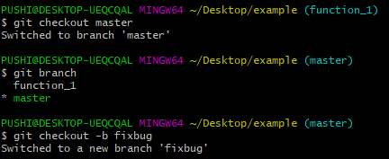

## git指令

```shell
# 首次使用git，输入以下两个命令来设置用户名和邮箱
git config --global user.name "(自定义用户名)"
git config --global user.email xxx@163.com
```

```shell
# 本地生成rsa秘钥
# windows生成位置在c:/User/xxx/.ssh/id_rsa,同级目录下的id_rsa.pub为公钥文件
ssh-keygen -t rsa 
```

```shell
# 显示git版本号
git --version

# git克隆项目到本地
git clone git@github.com:....git

# 将提交推送到远程master分支上
git push origin master
	origin 就是远程的名称
	master 就是分支的名称
	
# 查看远程名称
git remote -v

# 从远程master分支上获取最新的内容
git pull origin master

# git初始化，创建一个空的仓库，此时的文件夹里面多了一个.git文件夹
git init
```

```shell
# 查看git的文件状态
git status
	第一行On branch master 表示现处于master分支
    第二行No commits yet表示没有提交东西
    第三行提示可以创建文件，然后使用git add命令添加到track
```

 


```shell
# 添加指令（.代表添加所有文件）
git add .

# 撤销某个文件的添加
git reset HEAD 文件名

# eg:创建一个test.txt文件 -> 查看git的文件状态 -> 进行添加 -> 查看添加git的文件状态
touch test.txt
git status  # 此时会提示进行add添加，test.txt会显示为红色
git add test.txt 
git status  # 此时会提示进行commit提交，test.txt会显示为绿色
```

 

 


```shell
# commit提交给git管理，-m之后是提交的备注信息
git commit -m "添加test.txt文件" 
```

 


```shell
# 查看项目最近n条的历史提交记录
git log -n
```

 


```shell
# 修改提交的备注信息
git commit --amend 
```

 

 

 


```shell
# 只撤销提交（上次commit并没有真正撤销），暂存区还是保留之前的状态
git reset --soft HEAD~

# 撤销commit和add操作，直接回退到上一版本(此刻提交的文件就会消失，文件会恢复到上个版本)
git reset --hard HEAD~

# 指定特定的版本回退
git reset HEAD "commit id" 
```


## git分支

```shell
# 显示项目的分支情况，*表示当前处于的分支
git branch 
```

 


```shell
# 创建一个新分支，eg：创建一个dev分支 -> 查看项目分支情况
git branch dev
```

 


```shell
# 切换分支，eg：切换成dev分支 -> 查看项目分支情况（此时*指向dev分支）
git checkout dev

# 注意：
#1.在dev分支commit的东西在master分支是看不到的，因为master分支指向的还是上一次commit对象。
#2.开发具体功能时，不要直接在master下开发，应该新建一个分支出来，开发完成后再合并到master分支。
```

 


### 实际操作例子

1.创建了项目example，并使用git初始化

 


2.创建一些必要的文件，eg：code文件夹用来存放代码，images文件夹用来存放图片，data文件夹用来存放数据

 


3.在各个文件添加一些初始化的文件数据

eg1：在code文件夹下添加一些代码底层结构(如init.py文件)，然后进行提交

 


eg2：在images文件夹下存放一些公用图片素材，然后进行提交

 


eg3：在data文件夹下创建了数据库，然后进行提交

 

至此，在master分支上做了3次commit

 

3.假定A负责其中一个功能，如function_1，为A创建一个分支

 

tip：使用git checkout -b function_1 可以直接创建新分支function_1并切换过去

 

4.A在function_1分支完成功能，然后进行进行提交(理想情况下)

 

 


5.假定此时master分支上有BUG，A需要修复，步骤如下

①切换回master分支 -> ②创建修复分支修复BUG -> ③将修复后的分支合并到主分支 -> ④合并完成删除修复分支

 

  

①②开始修复BUG

 

tip：warning: LF will be replaced by CRLF in ... 原因是存在符号转义问题，windows中的换行符为CRLF，而在linux下的换行符为LF，所以在执行add时会出现提示，解决办法是 git config --global core.autocrlf false

 


③fixbug分支合并到master分支

 

 


④删除修复分支

 

 


6.A继续function_1功能开发

 


7.假定coding过程中需要回到master分支解决新BUG，代码没完成不好直接commit，此时直接切换到master分支会报错

 

**注意**：在分支有新东西未提交时，切换到其他分支git会提醒是否提交。但有些时候新东西并不是完全准备好的，所以可以使用git暂存功能，把未完成的东西暂存起来，等需要时再回来完成，此时git不会发现我们还有东西未提交，这样就可以切换到其他分支上啦


```shell
# 暂存功能指令
git stash 
```

 

切换到master分支后，修复操作同5


8.修复完成，继续function_1功能开发

 

此时发现function_1.py没看到之前写的东西(而之前是有做了git暂存)

 

git stash apply 恢复暂存的东西(就能看到之前的东西啦)

 

 

**注意**： 如果暂存多次，可以使用git stash list查看暂存记录。git stash apply stash@{1} 可以恢复指定编号的暂存记录


## git分支合并冲突

基于上述例子，在master分支上创建一个public.py文件

 

 


创建branch_A分支和branch_B分支

 


假定branch_A分支和branch_B分支同时操作到了public.py文件，并各自提交了

 

 

 

 

切换到master分支进行合并，(这里假设先合并branch_A，再合并branch_B；A会正常，B会报冲突)

 

 


在master分支下打开public.py文件进行查看

 

从上图可以看到branch_A和branch_B都在public.py这个文件做了操作。

其中`=======`用来区别不同分支的内容，在上面是(HEAD指向)master分支的内容，在下面是branch_B分支的内容。(这时候需要两个分支的主人进行讨论谁去谁留，然后进行修改。这里假定去掉branch_A的内容)

 

 


这样就解决了冲突，并以最终的结果合并到master分支上