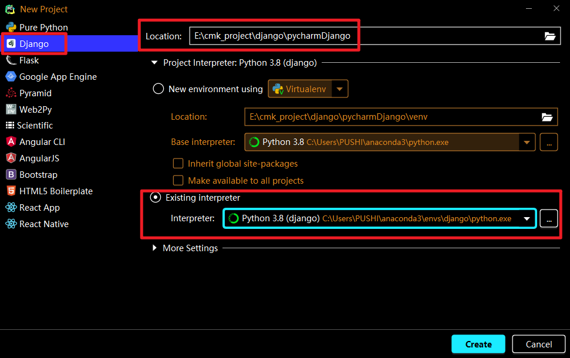
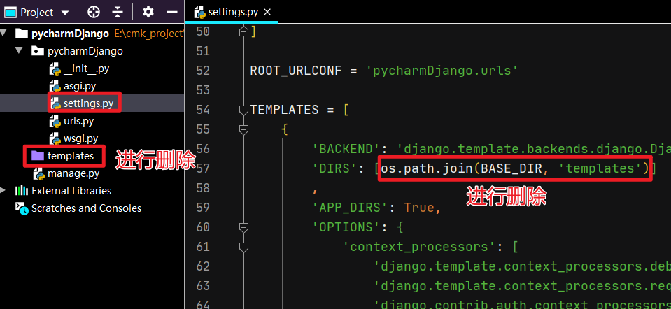
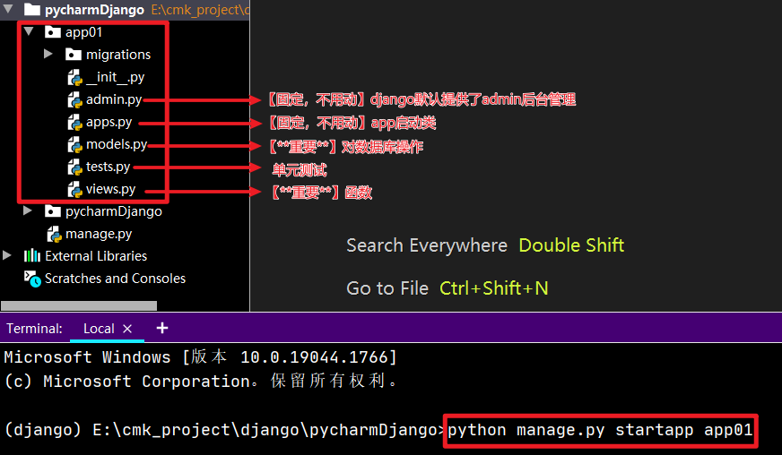
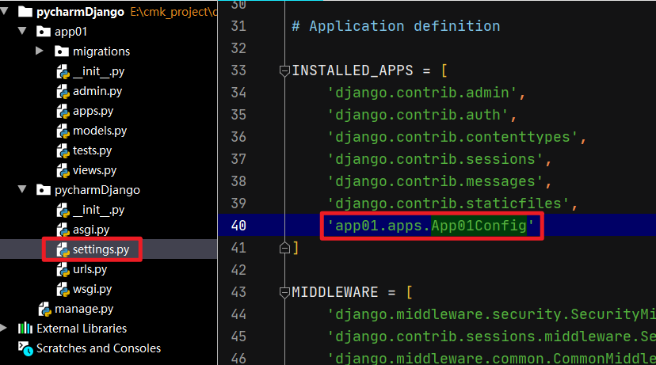
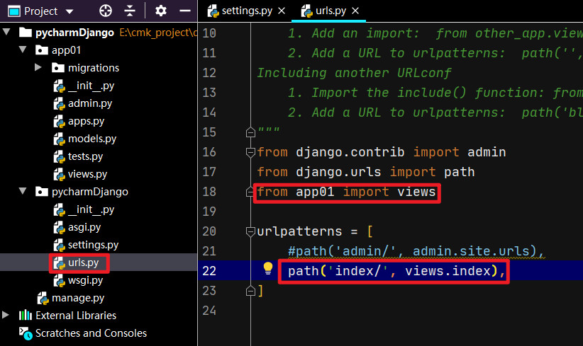
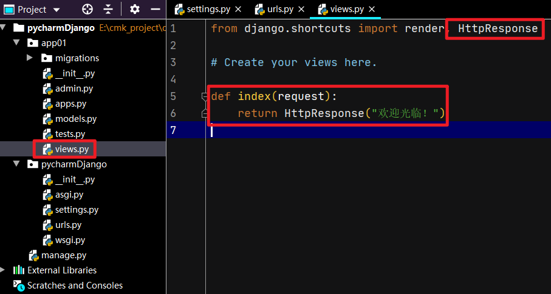
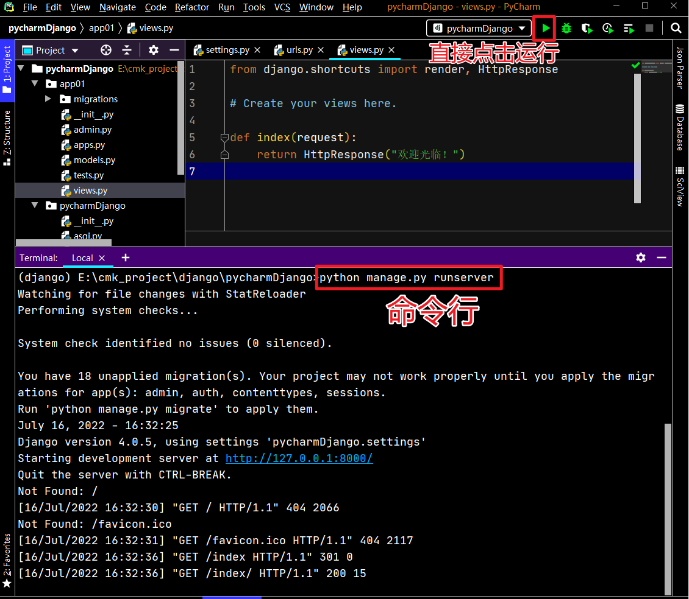
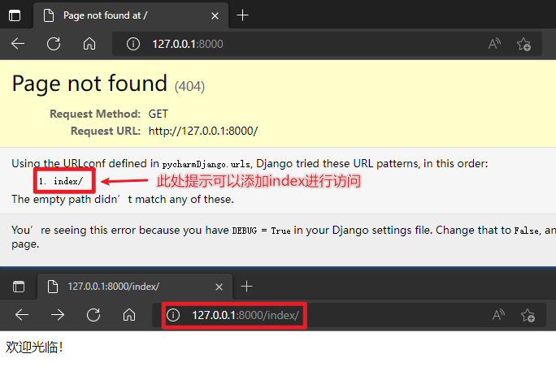
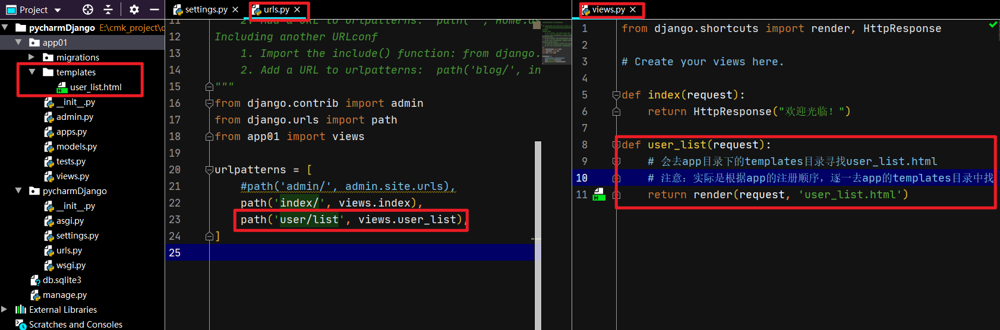
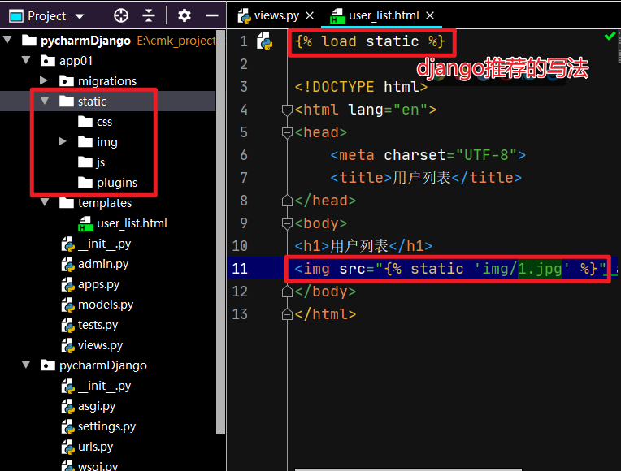

# django

## 1.安装django

> 会在pythonXX的Scripts目录中生成 django-admin.exe【用于创建django项目中的文件和文件夹】

```python
pip install django
```

## 2.创建项目

> django中项目会有一些默认的文件和默认文件夹

### 2.1在终端创建

```shell
"C:\Python310\Scripts\django-admin.exe" startproject 项目名称
```

```shell
# 如果C:\Python310\Scripts已加入环境变量
django-admin startproject 项目名称
```

### 2.2Pycharm



> pycharm创建django项目会比命令行多生成template目录，以及在setting.py文件中做了修改



默认项目的文件介绍

```
pycharmDjango
	manage.py 		【项目的管理，启动项目、创建app、数据管理】【常用，默认不动】
	pycharmDjango
		__init__.py 
		setting.py	【项目配置】【经常修改】
		urls.py		【URL和函数的对应关系】【经常修改】
		asgi.py		【接收网络请求】
		wsgi.py		【接收网络请求】
```


## 3.创建app




## 4.基本顺序

- 注册app【settings.py】



- 编写URL和视图函数对应关系【urls.py】



- 编写视图函数【app01/views.py】



- 启动django项目

  - 命令行启动

  ```shell
  python manage.py runserver
  ```

  - 直接在pycharm点击运行



- 访问



- templates模板




- 静态文件

> 放在app目录下的static目录中

